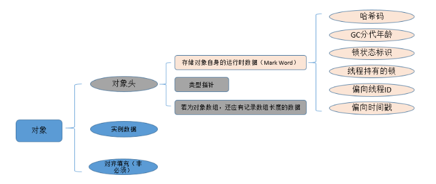
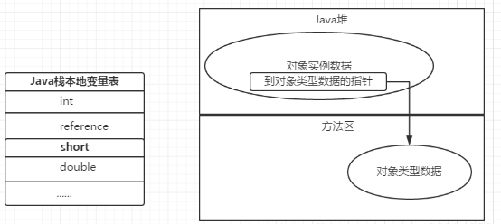

# JVM体系结构

虚拟机是物理机器的软件实现。Java 的开发遵循 write once run anywhere（“一次编写到处乱跑”）理念，它运行在 VM（虚拟机）上。编译器将 Java 文件编译成 Java.class 文件，之后，将 .class 文件输入到 JVM 中，加载并执行该类文件。下图是 JVM 的体系结构

## JVM 的体系结构

**运行时数据区:**
 经过编译生成的字节码文件（class文件），由 class loader（类加载子系统）加载后交给执行引擎执行。在执行引擎执行的过程中产生的数据会存储在一块内存区域。这块内存区域就是运行时区域

**程序计数器:**
用于记录当前线程的正在执行的字节码指令位置。由于虚拟机的多线程是切换线程并分配 cpu 执行时间的方式实现的，不同线程的执行位置都需要记录下来，因此程序计数器是线程私有的

**虚拟机栈:**
虚拟机栈是 Java 方法执行的内存结构，虚拟机会在每个 Java 方法执行时创建一个“栈桢”，用于存储局部变量表，操作数栈，动态链接，方法出口等信息。当方法执行完毕时，该栈桢会从虚拟机栈中出栈。其中局部变量表包含基本数据类型和对象引用

栈帧结构：

- 局部变量表：存储作用域中局部变量
- 操作数栈： 存储操作数，例如 `a = 1 + 1` 中的数字需要被存储入操作数栈。
- 动态链接： 在Java源文件被编译到字节码文件中时，所有的变量和方法引用都作为符号引用（Symbolic Reference）保存在class文件的常量池里。比如：描述一个方法调用了另外的其他方法时，就是通过常量池中指向方法的符号引用来表示的，那么动态链接的作用就是为了将这些符号引用转换为调用方法的直接引用。
- 方法出口：方法的退出存在两种情景：一是正常执行完成后退出，二是出现未处理的以长，非正常退出。无论哪种退出方式，方法退出后都会返回该方法的调用位置。方法正常退出时，调用者的pc计数器的值作为返回地址，即调用该方法的指令的下一条指令的地址。而通过异常退出的，返回地址是要通过异常表来确定，栈帧中一般不会保存这部分信息。

**本地方法栈：**
类似 Java 方法的执行有虚拟机栈，本地方法的执行则对应有本地方法栈

- 方法区：用于存储已被虚拟机加载的类信息，常量，静态变量，即时编译器编译后的代码等数据。线程共享（看存储的数据就知道了）
- Java 堆（Heap）：堆的主要作用是存放程序运行过程中创建的对象实例，因为要存放的对象实例有可能会极多，因此也是虚拟机内存管理中最大的一块。并且由于硬件条件有限，所以需要不断回收已“无用”的实例对象来腾出空间给新生成的实例对象；因此 Java 的垃圾回收主要是针对堆进行回收的（还有方法区的常量池），Java 堆很多时候也被称为GC堆（Garbage Collected Heap）。

**堆：**

Java堆（Java Heap）是虚拟机所管理的内存中最大的一块。Java堆是被所 有线程共享的一块内存区域，在虚拟机启动时创建。此内存区域的唯一目的就是存放对象实例。可以是不连续的。

**方法区：**

所有的方法区在逻辑上是属于堆的一部分，但一些简单的实现可能不会选择去进行垃圾收集或者进行压缩。它用于存储已被虚拟机加载的类的信息、常量、静态变量、即时编译器编译后的代码缓存等。方法区的大小决定了系统可以保存多少个类。

**类加载机制（Class Loader）：**
类加载子系统是根据一个类的全限定名来加载该类的二进制流到内存中，在JVM 中将形成一份描述 Class 结构的元信息对象（方法区），通过该元信息对象可以获知 Class 的结构信息：如构造函数，属性和方法等，Java 允许用户借由这个 Class 相关的元信息对象间接调用 Class 对象的功能。

## JAVA虚拟机对象

### 对象的创建

1. **检查常量池中是否已经存在**：虚拟机遇到一条new指令，先检查这个指令的参数是否能在常量池中定位到一个类的符号引用，并检查这个符号引用代表的类是否被加载，解析和初始化。
2. **类加载**：如果没有，那必须先执行相应的类加载过程。
3. **分配内存**：类加载检查通过后，虚拟机为新生对象分配内存。
4. **内存初始化**:内存分配完后，将分配到的内存空间全部初始化为0（不包括对象头）。根据虚拟机运行状态不同，作具体操作，如是否启用偏向锁，对象头会有不同设置方式等。
5. **init**：从虚拟机视角看，对象已经产生了，但从java程序的角度看，对象创建才刚开始。对象需要执行< init >方法

### 对象内存布局

### 对象访问定位

建立对象是为了使用对象，我们的Java程序需要通过栈上的reference数据来操作堆上的具体对象。由于reference类型在Java虚拟机规范中只规定了一个指向对象的引用，并没有定义这个引用应该通过何种方式去定位、访问堆中的对象的具体位置，所以对象访问方法也是取决于虚拟机的实现而决定的。目前主流的访问方式有使用句柄和直接指针两种。

**使用句柄**
如果使用句柄，java堆中会划分一块内存作为句柄池，reference中存储的是句柄地址，而句柄中包含了对象实例数据与类型数据各自具体的位置信息。

优点：reference存储的是稳定的句柄地址，在对象被移动（垃圾收集时移动对象是非常普遍的行为）时只会改变句柄中的实例数据指针，而reference本身不需要改变;
缺点：增加了一次指针定位的时间开销。

**使用指针**
使用指针，那么java堆对象的布局中就必须考虑如何存放访问类型数据的相关信息，reference中存储的就是对象信息。

优点：节省了一次指针定位的开销
缺点：在对象被移动时reference本身需要被修改。