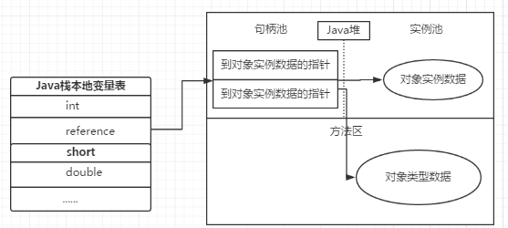

# JVM体系结构

虚拟机是物理机器的软件实现。Java 的开发遵循 write once run anywhere（“一次编写到处乱跑”）理念，它运行在 VM（虚拟机）上。编译器将 Java 文件编译成 Java.class 文件，之后，将 .class 文件输入到 JVM 中，加载并执行该类文件。下图是 JVM 的体系结构

## JVM 的体系结构

**运行时数据区:**
 经过编译生成的字节码文件（class文件），由 class loader（类加载子系统）加载后交给执行引擎执行。在执行引擎执行的过程中产生的数据会存储在一块内存区域。这块内存区域就是运行时区域

**程序计数器:**
用于记录当前线程的正在执行的字节码指令位置。由于虚拟机的多线程是切换线程并分配 cpu 执行时间的方式实现的，不同线程的执行位置都需要记录下来，因此程序计数器是线程私有的

**虚拟机栈:**
虚拟机栈是 Java 方法执行的内存结构，虚拟机会在每个 Java 方法执行时创建一个“栈桢”，用于存储局部变量表，操作数栈，动态链接，方法出口等信息。当方法执行完毕时，该栈桢会从虚拟机栈中出栈。其中局部变量表包含基本数据类型和对象引用

栈帧结构：

- 局部变量表：存储作用域中局部变量
- 操作数栈： 存储操作数，例如 `a = 1 + 1` 中的数字需要被存储入操作数栈。
- 动态链接： 在Java源文件被编译到字节码文件中时，所有的变量和方法引用都作为符号引用（Symbolic Reference）保存在class文件的常量池里。比如：描述一个方法调用了另外的其他方法时，就是通过常量池中指向方法的符号引用来表示的，那么动态链接的作用就是为了将这些符号引用转换为调用方法的直接引用。
- 方法出口：方法的退出存在两种情景：一是正常执行完成后退出，二是出现未处理的以长，非正常退出。无论哪种退出方式，方法退出后都会返回该方法的调用位置。方法正常退出时，调用者的pc计数器的值作为返回地址，即调用该方法的指令的下一条指令的地址。而通过异常退出的，返回地址是要通过异常表来确定，栈帧中一般不会保存这部分信息。

**本地方法栈：**
类似 Java 方法的执行有虚拟机栈，本地方法的执行则对应有本地方法栈

- 方法区：用于存储已被虚拟机加载的类信息，常量，静态变量，即时编译器编译后的代码等数据。线程共享（看存储的数据就知道了）
- Java 堆（Heap）：堆的主要作用是存放程序运行过程中创建的对象实例，因为要存放的对象实例有可能会极多，因此也是虚拟机内存管理中最大的一块。并且由于硬件条件有限，所以需要不断回收已“无用”的实例对象来腾出空间给新生成的实例对象；因此 Java 的垃圾回收主要是针对堆进行回收的（还有方法区的常量池），Java 堆很多时候也被称为GC堆（Garbage Collected Heap）。

**堆：**

Java堆（Java Heap）是虚拟机所管理的内存中最大的一块。Java堆是被所 有线程共享的一块内存区域，在虚拟机启动时创建。此内存区域的唯一目的就是存放对象实例。可以是不连续的。

**方法区：**

所有的方法区在逻辑上是属于堆的一部分，但一些简单的实现可能不会选择去进行垃圾收集或者进行压缩。它用于存储已被虚拟机加载的类的信息、常量、静态变量、即时编译器编译后的代码缓存等。方法区的大小决定了系统可以保存多少个类。

**类加载机制（Class Loader）：**
类加载子系统是根据一个类的全限定名来加载该类的二进制流到内存中，在JVM 中将形成一份描述 Class 结构的元信息对象（方法区），通过该元信息对象可以获知 Class 的结构信息：如构造函数，属性和方法等，Java 允许用户借由这个 Class 相关的元信息对象间接调用 Class 对象的功能。

## JAVA虚拟机对象

### 对象的创建

1. **检查常量池中是否已经存在**：虚拟机遇到一条new指令，先检查这个指令的参数是否能在常量池中定位到一个类的符号引用，并检查这个符号引用代表的类是否被加载，解析和初始化。
2. **类加载**：如果没有，那必须先执行相应的类加载过程。
3. **分配内存**：类加载检查通过后，虚拟机为新生对象分配内存。
4. **内存初始化**:内存分配完后，将分配到的内存空间全部初始化为0（不包括对象头）。根据虚拟机运行状态不同，作具体操作，如是否启用偏向锁，对象头会有不同设置方式等。
5. **init**：从虚拟机视角看，对象已经产生了，但从java程序的角度看，对象创建才刚开始。对象需要执行< init >方法

### 对象内存布局

### 对象访问定位

建立对象是为了使用对象，我们的Java程序需要通过栈上的reference数据来操作堆上的具体对象。由于reference类型在Java虚拟机规范中只规定了一个指向对象的引用，并没有定义这个引用应该通过何种方式去定位、访问堆中的对象的具体位置，所以对象访问方法也是取决于虚拟机的实现而决定的。目前主流的访问方式有使用句柄和直接指针两种。

**使用句柄**
如果使用句柄，java堆中会划分一块内存作为句柄池，reference中存储的是句柄地址，而句柄中包含了对象实例数据与类型数据各自具体的位置信息。

优点：reference存储的是稳定的句柄地址，在对象被移动（垃圾收集时移动对象是非常普遍的行为）时只会改变句柄中的实例数据指针，而reference本身不需要改变;
缺点：增加了一次指针定位的时间开销。

**使用指针**
使用指针，那么java堆对象的布局中就必须考虑如何存放访问类型数据的相关信息，reference中存储的就是对象信息。

优点：节省了一次指针定位的开销
缺点：在对象被移动时reference本身需要被修改。

## 垃圾回收

### 判断对象是否存活

确认对象是否存活的算法有两种引用计数法和可达性分析算法。

#### 引用计数法

给对象中添加一个应用计数器，每当对象被引用，计数器就+1，当引用失效时，计数器-1。计数器为0的对象不可能再被使用。
缺点：很难解决对象之间循环引用，比如父类引用子类，计数器不可能为0。

### 可达性分析

简而言之，在可达性分析算法中，不与GC Roots联通的节点，即为需要回收的对象。如object567。

这个算法的主要思路就是通过一些列GC Roots为起点，向下搜索。所走过的路径就是引用链。当一个对象没有与GC Roots相连，就说明他已经是不可用的了。

**那么GC Roots有哪些呢？**

1. 栈中引用的对象
2. 本地方法栈中引用的对象
3. （方法区中）静态变量引用的对象
4. （方法区中）常量引用的对象

引用再分类
上面的算法中，引用只有两种情况：不回收，回收。
JDK1.2后，java对引用概念进行了扩充。分为了强引用，软引用，弱引用，虚引用。
**强引用**：在代码中普遍存在，Object obj=new Object（）；。只要引用还在，垃圾回收器永远不会回收。
**软引用**：有用但非必须的。如果内存要溢出了，才去回收。
**弱引用**：非必须的对象，只能存活到下一次垃圾回收之前。
**虚引用**：最弱的引用，这个引用不会对生存时间构成影响，也不能通过这个引用取得对象，对象设置虚引用只是为了在被回收时收到一个系统通知。

### 垃圾收集算法

**标记-清除算法**：

标记所有要回收的对象，然后统一回收。
不足：1.标记和清除的效率都不高。
2.会产生大量不连续的碎片。
3.在碎片中无法找到足够的连续内存又会触发垃圾回收。

**复制算法**：

将内存分为两块，每次只使用其中一块。当这一块用完了，将所有存活对象复制到另一块上，然后将这一块的内存全部清理掉。
缺点：分为两半是在是太多了。因为很多对象刚刚被引用就死了，所以1：1不明智。浪费了50%的内存。

**标记-整理算法**：

标记所有要回收的对象。然后把所有存活对象复制到内存的一端（覆盖掉要回收的对象）。然后把边界以外的内存全部清除。

**分代回收**：

主流算法。复制算法的升级。

将对象分为新生代，老年代和永久代。
新生代是新生的对象，很多刚出生就死了的对象。
老年代是存活得比较久，但还是可能死的对象。
永久代是一般不死的。

将内存分为原始区（eden），两个生存区（survivor from和survivor to），一个老年区和一个永久区。
原始区：存放刚刚新生的新生代。经历垃圾回收动作存活下来的进入生存区。
生存区：存放活过一段时间的新生代，他们每经历过一次垃圾回收动作存活下来后就会去另一个生存区。生存了很多次以后就会进入老年区。
老年区：存放活了很久的对象
永久区：存放如类加载信息等一般不死的对象的区域。

### 垃圾收集器

#### Serial收集器

Serial是一个单线程的收集器。单线程并不仅仅说明只使用一个CPU，更重要的是必须暂停所有其他工作（Stop the world）。
好比“你妈妈在为你打扫房间的时候，你不能再一旁乱扔纸屑，这样房间是打扫不完的”。
优点：简单而高效（与其他收集器的单线程相比），在限于单个CPU的环境，没有额外的线程交互的开销，所以能获得最高效率。
通常使用于Client，停顿时间可以控制在十几毫秒，最多一百毫秒以内。

#### ParNew收集器

ParNew收集器是Serial收集器的多线程版本。所有控制参数，收集算法，Stop the world，对象分配规则，回收策略等都和Serial收集器完全一样。
除了Serial，目前只能和CMS收集器配合工作。
运行在server模式下的虚拟机首选的新生代收集器。
缺点：单CPU环境，不及Serial。

#### Parallel Scavenge收集器

Parallel Scavenge收集器是一个新生代收集器，适用复制算法。
并行的多线程收集器。
与ParNew和CMS不同的是收集器目标。
CMS等收集器关注点在于尽可能缩短垃圾收集时用户线程停顿的时间。
Parallel Scavenge则是达到一个可控制的吞吐量。
吞吐量=运行用户代码的时间/（运行用户代码的时间+垃圾收集时间）。
所以也称为“吞吐量优先”收集器。

#### Serial Old收集器

单线程，使用标记整理算法。
主要给Client模式下的虚拟机用。
Server模式下可以和Parallel Scavenge配合使用，也可以作为CMS收集器的后备预案。

#### Parallel Old收集器

Parallel Old收集器是Parallel Scavenge收集器的老年代版本。使用多线程和标记-整理算法。
配合Parallel Scavenge组成名副其实的“吞吐量优先”应用组合。

#### CMS收集器

CMS收集器是一种以获得最短回收停顿时间为目标的收集器。基于标记-清除算法。
分为4个步骤

- 初始标记
- 并发标记
- 重新标记
- 并发清除

**初始标记**：仅仅标记一下GC Roots能直接关联的对象，速度很快。
**并发标记**：进行GC Roots Tracing的过程
**重新标记**：为了修正并发标记期间因为用户程序继续运行而导致标记产生变动的那一部分对象的标记记录。
**并发清除**：清除所有标记的对象。

初始标记耗时<重新标记耗时<并发标记耗时和并发清除耗时

整个过程中最耗时的并发标记和并发清除过程收集器线程都可以和用户线程一起工作，所以停顿时间是很短的。

**缺点**：
 1.并发导致应用程序变慢。
 2.无法处理浮动垃圾。浮动垃圾就是在并发清除时，应用程序产生的垃圾。
 3.标记清除算法导致碎片多。为此官方提供了一个碎片整合过程，相当于多次标记清除后再整理，但停顿时间边长了。

#### G1收集器

G1（Garbage-First）收集器是当今收集器技术发展的最前沿成果之一。
G1是面向服务端应用的垃圾收集器。
特点：
1.并行与并发：利用多CPU缩短Stop the world
2.分代收集
3.空间整合：使用标记-整理算法
4.可预测的停顿：可以指定在一个时间片段内，消耗在垃圾收集的时间上不得超过一个阈值。

**分区**
G1的内存模型与其他收集器不太一样，它将整个java堆分为了大小相等的分区Region，虽然还保留了分代的概念，但是新生代和老年代已经不再是物理隔离的了，他们都是一部分Region（不需要连续）的集合。

**卡片**
在每个分区内部又被分成了若干个大小为512 Byte卡片(Card)，标识堆内存最小可用粒度所有分区的卡片将会记录在全局卡片表(Global Card Table)中，分配的对象会占用物理上连续的若干个卡片，当查找对分区内对象的引用时便可通过记录卡片来查找该引用对象(见RSet)。**每次对内存的回收，都是对指定分区的卡片进行处理。**

**Remember Set**
G1收集器之所以能建立可预测的停顿时间模型，是因为他可以有计划地避免在整个Java堆中进行全区域的垃圾收集。G1跟踪每一个Region中的垃圾堆积的价值大小（回收的空间大小和所需要的时间），在后台维护一个优先队列，每次根据允许运行垃圾回收的时间，优先回收价值最大的那个Region。
**工作流程**

如果不计算维护Remember Set的操作，G1运行大致可以划分为以下步骤。

- 初始标记
- 并发标记
- 最终标记
- 筛选标记

**初始标记**：标记GC Roots能直接关联到的对象，并且修改TAMS（Next Top at Mark Start）。让下一阶段用户线程并发运行时可以正确在可用的Region中创建新的对象，这个阶段需要消耗线程但是耗时很短。
**并发标记**：从GC Roots开始对堆中的对象进行可达性分析，耗时长，可以**与用户线程并发。**
**最终标记**：修正并发标记期间因为用户线程导致标记变动的那一部分标记记录。变动记录在线程Remember Set Logs里面。**需要停顿线程，但是可以并行执行。**
**筛选回收**：在优先队列中排序，选出运行时间内价值最大的那个Region回收。
