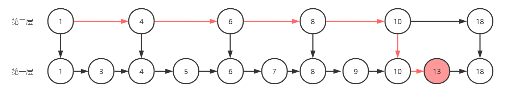

# redis数据类型

## String 字符串

字符串是最基本的Redis值。Redis字符串是二进制安全的，这意味着Redis字符串可以包含任何类型的数据，例如JPEG图像或序列化的Ruby对象。

字符串值的最大长度为``512``兆字节。

你可以在 Redis 中使用字符串做一些有趣的事情，例如你可以：

- 使用 INCR 系列中的命令将字符串用作原子计数器：INCR、DECR、INCRBY。
- 使用APPEND命令附加到字符串。
- 使用字符串作为带有GETRANGE和SETRANGE的随机访问向量。
- 在很小的空间内编码大量数据，或者使用GETBIT和SETBIT创建一个 Redis 支持的 Bloom Filter 。

查看所有可用的字符串命令以获取更多信息，或阅读Redis 数据类型介绍。

## Lists 列表

Redis列表是简单的字符串列表，按插入顺序排序。可以将元素添加到Redis列表中，将新元素推送到列表的头部（左侧）或尾部（右侧）。

LPUSH命令在头部插入一个新元素，而RPUSH在尾部插入一个新元素。当对空键执行此操作之一时，将创建一个新列表。同样，如果列表操作将清空列表，则从键空间中删除键。这些是非常方便的语义，因为如果使用不存在的键作为参数调用所有列表命令，它们的行为将与使用空列表调用时完全一样。

列表操作和结果列表的一些示例：

```sh
LPUSH mylist a   # now the list is "a"
LPUSH mylist b   # now the list is "b","a"
RPUSH mylist c   # now the list is "b","a","c" (RPUSH was used this time)
```

列表的最大长度为 2^32 - 1 个元素（4294967295，每个列表超过 40 亿个元素）。

redis list 由双向链表实现，从时间复杂度的角度来看，Redis Lists的主要特点是支持恒定时间插入和删除靠近头部和尾部的元素，即使插入了数百万个元素。访问列表的极端附近的元素非常快，但如果您尝试访问一个非常大的列表的中间，则速度很慢，因为这是一个 O(N) 操作。

### redis list 数据结构

redis list底层实现使用了两种数据结构：

- ziplist
- quicklist

当数据量较小时，将会使用ziplist，即压缩列表 . 它将所有的元素紧挨着一起存储，分配的是一块连续的内存。

当数据量较大时，会改用quicklist，quicklist是多个ziplist组合起来的结构。


quickList就是一个标准的双向链表的配置,每一个节点是一个quicklistNode，包含prev和next指针。每一个quicklistNode 包含 一个ziplist。所以quicklist是对ziplist进行一次封装，使用小块的ziplist来既保证了少使用内存，也保证了性能。

不用普通的链表：因为普通的链表需要的附加指针空间太大，会比较浪费空间，而且会加重内存的碎片化 .

### ziplist

ziplist是Redis list、hash、zset的底层实现结构之一，当list、hash、zset中节点数量较少，并且存储的大多节点为小整数型，较短的字符串时，Redis就会使用ziplist作为list、hash、zset的底层实现。


ziplist结构：

- zlbytes：记录整个ziplist的大小。
- zltail：ziplist开始指针与最后一个entry之间的偏移量，通过该偏移量可以获得最后一个entry。
- zllen：entry数量。
- entry：存储具体数据的节点。
- zlend：ziplist结尾标识。

entry结构：

- previous_entry_length：上一个entry的大小。上一个entry长度小于等于263字节时，只占一个字节，否则占5个字节。
- encoding：记录content的类型以及长度。
- content：一个整形或者字节数组。

## Sets 集合

Redis Set是字符串的无序集合。可以在 O(1) 中添加、删除和测试成员的存在（无论集合中包含的元素数量如何，都是恒定的时间）。

Redis Set具有不允许重复元素，多次添加同一元素集合中对应元素也只有一个。

集合中的最大成员数为 2^32 - 1（4294967295，每组超过 40 亿个成员）。

### Redis sets 数据结构

redis sets由两种数据结构实现：

- intset
- hashset

当存储当value是整数值时，且数据量不大时使用inset来存储。
其他情况都是用hashset来存储。

### intset

1. 整数集合中, 元素按照值的大小由小到大排列;
2. 可以保存int16_t, int32_t, int64_t类型的数据
3. 存储数据时, 可以保证其内部不出现重复的数据
当一个set只包含整数元素, 并且元素不多的时候, Redis就可能使用intset来实现set

```c
typedef struct intset {
    uint32_t encoding; // 编码类型
    uint32_t length;   // 元素数量
    int8_t contents[]; // 元素数组
}intset;
```

### intset升级hashset

当数据量过大时，intset将会升级为hashset，并且不可降级。

1. 根据新元素的类型, 扩展底层元素的空间, 并为新元素分配空间
2. 将现有的元素都转为新的元素类型, 并存储在正确的空间上面
3. 将新元素添加进数组内

## Hashes 哈希表

Redis哈希是字符串字段和字符串值之间的映射，因此它们是表示对象的完美数据类型（例如，具有许多字段的用户，如姓名、姓氏、年龄等）：

```sh
HMSET user:1000 username antirez password P1pp0 age 34
HGETALL user:1000
HSET user:1000 password 12345
HGETALL user:1000
```

可以在一个小型Redis实例中存储数百万个对象。

每个hash最多可以存储 2^32 - 1 个字段值对（超过40亿个）。

### redis hash 数据结构

redis hash底层使用了两种数据结构：

- ziplist
- hashtable

当保存的所有键值对字符串长度小于 64 字节并且键值对数量小于 512 时使用ziplist ，否则使用字典的方式

## Sorted Sets 排序集合

Redis Sorted Sets与Redis Sets类似，是字符串的非重复集合。不同之处在于，Sorted Set的每个成员都与一个分数相关联，用于保持Sorted Set的顺序，从最小到最大的分数。虽然成员是唯一的，但分数可能会重复。

### Sorted Sets 数据结构

redis Sorted Sets使用ziplist 或 跳表（skiplist）作为底层数据结构。

跳跃表的性能堪比红黑树，而且实现起来比红黑树简单很多。那么什么是跳跃表？理解跳跃表之间我们先来看一看下面这个链表。


 假如我们要查询值为 13的节点，对于上面的单向链表来说，我需要从前往后遍历节点，算一下要进行 10 次查找，性能是非常差的，如何提升查询速度？我们知道即使有序的链表也是没变法进行二分查找的，除非我们把这个链表变成红黑树这样的结构，但是红黑树实现起来太过麻烦。所以，如果我把这个链表像这样处理一下呢？



 我把第一层链表中的元素，每隔2个元素就向上提取一个元素，形成第二层的链表，如上图，如果我查找元素的时候先从最上面的层级找 13 ，当找到 18的时候大于13，就退回10，往下一层找，然后就找到13了，你数一下这一次的查找次数几乎是之前的单向链表的一半，大大节省了查询时间。那如果我再往上抽取一层呢？


## Bitmaps and HyperLogLogs

## Streams

## Geospatial indexes
