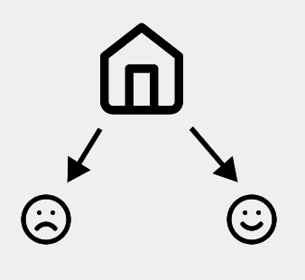
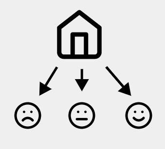
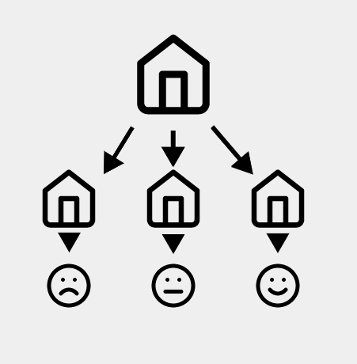
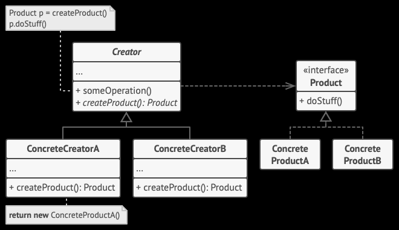

# 工厂方法模式

```工厂方法模式```是一种创建型设计模式， 其在父类中提供一个创建对象的方法， 允许子类决定实例化对象的类型。

> 工厂方法模式：定义一个用于创建对象的接口但是让子类决定将哪一个类实例化。工厂方法模式让一个类的实例化延迟到其子类

## 🔩 简单工厂方法

在说工厂方法之前，先引入简单工厂的概念。简单工厂方法不属于GOF的23种经典设计模式，这里简单说说。

现在有一个表情工厂，当用户需要某种表情时，他不需要关心表情是如何生成的，只需要告诉工厂他所需要的表情的名字就行，工厂根据参数的不同返回不同的产品，这就是简单工厂模式的动机。



## ❔ 问题

现在需要在表情工厂中新增一个表情，如果使用简单工厂那么除了增加一个新的具体产品之外还需要修改工厂类的代码，使得整个设计**违反**了[开闭原则](/设计模式/1.SOLID原则.md#开闭原则)。



## 🔧 解决办法

现在对该系统进行修改，不再提供一个表情工厂类来统一负责所有的表情的创建，而是将具体表情的创建过长交给专门的工厂子类去完成。先定义一个抽象表情工厂，再定义多个具体的工厂类来生产格子对应的表情，它们实现了在抽象按钮工厂类中声明的方法。这就是工厂方法模型，通过引入抽象工厂类，使他具备了代码的稳定性，和拓展性，符合了开闭原则。



## 🔩 工厂方法模式结构



## 📄 伪代码

以下示例演示了如何使用工厂方法开发跨平台 UI （用户界面） 组件， 并同时避免客户代码与具体 UI 类之间的耦合。


```java
// 创建者类声明的工厂方法必须返回一个产品类的对象。创建者的子类通常会提供
// 该方法的实现。
class Dialog is
    // 创建者还可提供一些工厂方法的默认实现。
    abstract method createButton():Button

    // 请注意，创建者的主要职责并非是创建产品。其中通常会包含一些核心业务
    // 逻辑，这些逻辑依赖于由工厂方法返回的产品对象。子类可通过重写工厂方
    // 法并使其返回不同类型的产品来间接修改业务逻辑。
    method render() is
        // 调用工厂方法创建一个产品对象。
        Button okButton = createButton()
        // 现在使用产品。
        okButton.onClick(closeDialog)
        okButton.render()


// 具体创建者将重写工厂方法以改变其所返回的产品类型。
class WindowsDialog extends Dialog is
    method createButton():Button is
        return new WindowsButton()

class WebDialog extends Dialog is
    method createButton():Button is
        return new HTMLButton()


// 产品接口中将声明所有具体产品都必须实现的操作。
interface Button is
    method render()
    method onClick(f)

// 具体产品需提供产品接口的各种实现。
class WindowsButton implements Button is
    method render(a, b) is
        // 根据 Windows 样式渲染按钮。
    method onClick(f) is
        // 绑定本地操作系统点击事件。

class HTMLButton implements Button is
    method render(a, b) is
        // 返回一个按钮的 HTML 表述。
    method onClick(f) is
        // 绑定网络浏览器的点击事件。


class Application is
    field dialog: Dialog

    // 程序根据当前配置或环境设定选择创建者的类型。
    method initialize() is
        config = readApplicationConfigFile()

        if (config.OS == "Windows") then
            dialog = new WindowsDialog()
        else if (config.OS == "Web") then
            dialog = new WebDialog()
        else
            throw new Exception("错误！未知的操作系统。")

    // 当前客户端代码会与具体创建者的实例进行交互，但是必须通过其基本接口
    // 进行。只要客户端通过基本接口与创建者进行交互，你就可将任何创建者子
    // 类传递给客户端。
    method main() is
        this.initialize()
        dialog.render()
```

## 💡工厂方法模式适合应用场景

> 🔎 当你在编写代码的过程中， 如果无法预知对象确切类别及其依赖关系时， 可使用工厂方法。

工厂方法将创建产品的代码与实际使用产品的代码分离， 从而能在不影响其他代码的情况下扩展产品创建部分代码。

例如， 如果需要向应用中添加一种新产品， 你只需要开发新的创建者子类， 然后重写其工厂方法即可。

> 🔎 如果你希望用户能扩展你软件库或框架的内部组件， 可使用工厂方法。

继承可能是扩展软件库或框架默认行为的最简单方法。 但是当你使用子类替代标准组件时， 框架如何辨识出该子类？

解决方案是将各框架中构造组件的代码集中到单个工厂方法中， 并在继承该组件之外允许任何人对该方法进行重写。

> 🔎 如果你希望复用现有对象来节省系统资源， 而不是每次都重新创建对象， 可使用工厂方法。

## 🆚 工厂方法的优缺点

- ✅ 你可以避免创建者和具体产品之间的紧密耦合。
- ✅ 单一职责原则。 你可以将产品创建代码放在程序的单一位置， 从而使得代码更容易维护。
- ✅ 开闭原则。 无需更改现有客户端代码， 你就可以在程序中引入新的产品类型。
- ❌  应用工厂方法模式需要引入许多新的子类， 代码可能会因此变得更复杂。 最好的情况是将该模式引入创建者类的现有层次结构中。

## 🧩 与其他模式的关系

- 在许多设计工作的初期都会使用工厂方法模式 （较为简单， 而且可以更方便地通过子类进行定制）， 随后演化为使用抽象工厂模式、 原型模式或生成器模式 （更灵活但更加复杂）。
- 抽象工厂模式通常基于一组工厂方法， 但你也可以使用原型模式来生成这些类的方法。
- 你可以同时使用工厂方法和迭代器模式来让子类集合返回不同类型的迭代器， 并使得迭代器与集合相匹配。
- 原型并不基于继承， 因此没有继承的缺点。 另一方面， 原型需要对被复制对象进行复杂的初始化。 工厂方法基于继承， 但是它不需要初始化步骤。
- 工厂方法是模板方法模式的一种特殊形式。 同时， 工厂方法可以作为一个大型模板方法中的一个步骤。